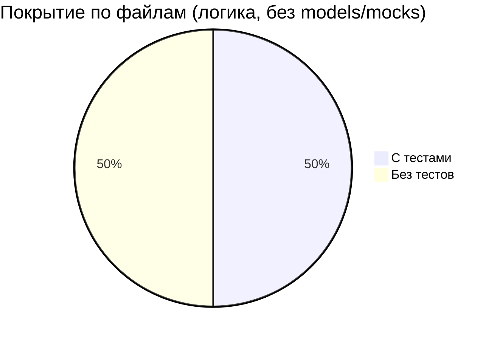

# Отчёт о покрытии бэкенда тестами

> Проект: **docflow** (Go + Wails)
> Дата анализа: 2026-03-03
> Метод: статический анализ (сопоставление исходных файлов и тестов)

---

## Общая картина

| Слой | Файлов | С тестами | Без тестов | Покрытие |
|------|--------|-----------|------------|----------|
| **services** | 14 | 10 | 4 | **71%** |
| **repository** | 12 | 1 | 11 | **8%** |
| **config** | 2 | 2 | 0 | **100%** |
| **security** | 1 | 1 | 0 | **100%** |
| **database** | 1 | 1 | 0 | **100%** |
| **dto** | 2 | 1 | 1 | **50%** |
| **models** | 8 | 0 | — | —¹ |
| **mocks** | 12 | 0 | — | —² |
| **Итого (логика)** | **32** | **15** | **16** | **~50%** |

> ¹ Models — структуры данных и константы, не требуют юнит-тестов.
> ² Mocks — автоматически сгенерированные заглушки для тестов.

---

## Детализация по пакетам

### `internal/services` — Бизнес-логика (основной слой)

#### ✅ Покрытые тестами (10 из 14 сервисов)

| Сервис | Файл | Функций | Тест-файл |
|--------|------|---------|-----------|
| AuthService | [auth_service.go](file:///d:/work/projects/GO/docs-register-and-track-ai/internal/services/auth_service.go) | 12 | [auth_service_test.go](file:///d:/work/projects/GO/docs-register-and-track-ai/internal/services/auth_service_test.go) |
| AcknowledgmentService | [acknowledgment_service.go](file:///d:/work/projects/GO/docs-register-and-track-ai/internal/services/acknowledgment_service.go) | 8 | [acknowledgment_service_test.go](file:///d:/work/projects/GO/docs-register-and-track-ai/internal/services/acknowledgment_service_test.go) |
| AssignmentService | [assignment_service.go](file:///d:/work/projects/GO/docs-register-and-track-ai/internal/services/assignment_service.go) | 7 | [assignment_service_test.go](file:///d:/work/projects/GO/docs-register-and-track-ai/internal/services/assignment_service_test.go) |
| AttachmentService | [attachment.go](file:///d:/work/projects/GO/docs-register-and-track-ai/internal/services/attachment.go) | — | [attachment_test.go](file:///d:/work/projects/GO/docs-register-and-track-ai/internal/services/attachment_test.go) |
| DashboardService | [dashboard_service.go](file:///d:/work/projects/GO/docs-register-and-track-ai/internal/services/dashboard_service.go) | — | [dashboard_service_test.go](file:///d:/work/projects/GO/docs-register-and-track-ai/internal/services/dashboard_service_test.go) |
| IncomingDocService | [incoming_doc_service.go](file:///d:/work/projects/GO/docs-register-and-track-ai/internal/services/incoming_doc_service.go) | 6 | [incoming_doc_service_test.go](file:///d:/work/projects/GO/docs-register-and-track-ai/internal/services/incoming_doc_service_test.go) |
| OutgoingDocService | [outgoing_doc_service.go](file:///d:/work/projects/GO/docs-register-and-track-ai/internal/services/outgoing_doc_service.go) | 6 | [outgoing_doc_service_test.go](file:///d:/work/projects/GO/docs-register-and-track-ai/internal/services/outgoing_doc_service_test.go) |
| SettingsService | [settings.go](file:///d:/work/projects/GO/docs-register-and-track-ai/internal/services/settings.go) | — | [settings_test.go](file:///d:/work/projects/GO/docs-register-and-track-ai/internal/services/settings_test.go) |
| SystemService | [system_service.go](file:///d:/work/projects/GO/docs-register-and-track-ai/internal/services/system_service.go) | — | [system_service_test.go](file:///d:/work/projects/GO/docs-register-and-track-ai/internal/services/system_service_test.go) |
| UserService | [user_service.go](file:///d:/work/projects/GO/docs-register-and-track-ai/internal/services/user_service.go) | — | [user_service_test.go](file:///d:/work/projects/GO/docs-register-and-track-ai/internal/services/user_service_test.go) |
| Helpers | [helpers.go](file:///d:/work/projects/GO/docs-register-and-track-ai/internal/services/helpers.go) | — | [helpers_test.go](file:///d:/work/projects/GO/docs-register-and-track-ai/internal/services/helpers_test.go) |

#### ❌ Без тестов (4 сервиса)

| Сервис | Файл | Функций | Приоритет |
|--------|------|---------|-----------|
| **DepartmentService** | [department_service.go](file:///d:/work/projects/GO/docs-register-and-track-ai/internal/services/department_service.go) | 5 (CRUD + New) | 🟡 Средний |
| **LinkService** | [link_service.go](file:///d:/work/projects/GO/docs-register-and-track-ai/internal/services/link_service.go) | 5 (Link/Unlink/GetLinks/GetFlow + New) | 🔴 Высокий |
| **NomenclatureService** | [nomenclature_service.go](file:///d:/work/projects/GO/docs-register-and-track-ai/internal/services/nomenclature_service.go) | 6 (CRUD + GetActive + New) | 🟡 Средний |
| **ReferenceService** | [reference_service.go](file:///d:/work/projects/GO/docs-register-and-track-ai/internal/services/reference_service.go) | 10 (DocTypes CRUD + Orgs CRUD + Search + New) | 🔴 Высокий |

> **`interfaces.go`** содержит только интерфейсы (11 шт.) — тесты не требуются.

---

### `internal/repository` — Слой доступа к данным

| Репозиторий | Файл | Тест |
|-------------|------|------|
| UserRepository | [user_repo.go](file:///d:/work/projects/GO/docs-register-and-track-ai/internal/repository/user_repo.go) | ✅ [user_repo_test.go](file:///d:/work/projects/GO/docs-register-and-track-ai/internal/repository/user_repo_test.go) |
| AcknowledgmentRepository | [acknowledgment_repo.go](file:///d:/work/projects/GO/docs-register-and-track-ai/internal/repository/acknowledgment_repo.go) | ❌ |
| AssignmentRepository | [assignment_repo.go](file:///d:/work/projects/GO/docs-register-and-track-ai/internal/repository/assignment_repo.go) | ❌ |
| AttachmentRepository | [attachment.go](file:///d:/work/projects/GO/docs-register-and-track-ai/internal/repository/attachment.go) | ❌ |
| DashboardRepository | [dashboard_repo.go](file:///d:/work/projects/GO/docs-register-and-track-ai/internal/repository/dashboard_repo.go) | ❌ |
| DepartmentRepository | [department_repository.go](file:///d:/work/projects/GO/docs-register-and-track-ai/internal/repository/department_repository.go) | ❌ |
| IncomingDocRepository | [incoming_doc_repo.go](file:///d:/work/projects/GO/docs-register-and-track-ai/internal/repository/incoming_doc_repo.go) | ❌ |
| LinkRepository | [link_repo.go](file:///d:/work/projects/GO/docs-register-and-track-ai/internal/repository/link_repo.go) | ❌ |
| NomenclatureRepository | [nomenclature_repo.go](file:///d:/work/projects/GO/docs-register-and-track-ai/internal/repository/nomenclature_repo.go) | ❌ |
| OutgoingDocRepository | [outgoing_doc_repo.go](file:///d:/work/projects/GO/docs-register-and-track-ai/internal/repository/outgoing_doc_repo.go) | ❌ |
| ReferenceRepository | [reference_repo.go](file:///d:/work/projects/GO/docs-register-and-track-ai/internal/repository/reference_repo.go) | ❌ |
| SettingsRepository | [settings.go](file:///d:/work/projects/GO/docs-register-and-track-ai/internal/repository/settings.go) | ❌ |

> Покрытие: **1 из 12** (8%). Уже используется `go-sqlmock` для тестирования.

---

### `internal/config`, `internal/security`, `internal/database`

| Пакет | Файлы | Тесты | Статус |
|-------|-------|-------|--------|
| config | `config.go`, `crypto.go` | `config_test.go`, `crypto_test.go` | ✅ Полное покрытие |
| security | `password.go` | `password_test.go` | ✅ Полное покрытие |
| database | `postgres.go` | `postgres_test.go` | ✅ Покрыто |

### `internal/dto`

| Файл | Тест | Статус |
|------|------|--------|
| `dto.go` (258 строк, только структуры) | — | Тесты не нужны |
| `mapper.go` (469 строк, 26 функций-маппинга) | `mapper_test.go` | ✅ Покрыто |

---

## Визуализация покрытия по слоям



---

## Ключевые выводы

> [!IMPORTANT]
> Общее покрытие файлов с логикой — **~50%**. Слой **services** покрыт на 71%, а слой **repository** практически не покрыт (8%).

1. **Сильные стороны:**
   - Все ключевые «ядровые» пакеты покрыты: `config`, `security`, `database`
   - Основные бизнес-сервисы (auth, documents, assignments) имеют тесты
   - Используется правильный подход: моки для store-интерфейсов, `go-sqlmock` для репозиториев
   - DTO-маппинг покрыт тестами

2. **Основные пробелы:**
   - **4 сервиса без тестов** — `LinkService`, `ReferenceService`, `DepartmentService`, `NomenclatureService`
   - **11 репозиториев без тестов** — весь SQL-слой кроме `user_repo`
   - `main.go` не покрыт (приемлемо для точки входа Wails-приложения)

---

# План доработки тестов

## Фаза 1 — Сервисный слой (Приоритет: 🔴 Высокий)

> Моки уже есть для всех store-интерфейсов → тесты пишутся быстро по существующему паттерну.

### 1.1. `reference_service_test.go` [NEW]

Самый крупный непокрытый сервис (10 функций).

**Тесты:**
- `TestGetDocumentTypes` — успех, неавториз.
- `TestCreateDocumentType` — успех, forbidden (не admin)
- `TestUpdateDocumentType` — успех, невалидный ID, forbidden
- `TestDeleteDocumentType` — успех, невалидный ID, forbidden
- `TestGetOrganizations` — успех, неавториз.
- `TestSearchOrganizations` — успех, неавториз.
- `TestFindOrCreateOrganization` — успех, неавториз.
- `TestUpdateOrganization` — успех, невалидный ID, forbidden
- `TestDeleteOrganization` — успех, невалидный ID, forbidden

### 1.2. `link_service_test.go` [NEW]

Сложная логика в `GetDocumentFlow` с построением графа.

**Тесты:**
- `TestLinkDocuments` — успех, неавториз., невалидные ID, самосвязывание
- `TestUnlinkDocument` — успех, невалидный ID
- `TestGetDocumentLinks` — успех, невалидный ID
- `TestGetDocumentFlow` — пустой граф, граф с incoming/outgoing узлами, невалидный ID

### 1.3. `department_service_test.go` [NEW]

**Тесты:**
- `TestGetAllDepartments` — успех, неавториз.
- `TestCreateDepartment` — успех, forbidden
- `TestUpdateDepartment` — успех, невалидный ID, forbidden
- `TestDeleteDepartment` — успех, невалидный ID, forbidden

### 1.4. `nomenclature_service_test.go` [NEW]

**Тесты:**
- `TestGetAll` — успех, неавториз.
- `TestGetActiveForDirection` — успех, неавториз.
- `TestCreate` — успех, forbidden (не admin и не clerk)
- `TestUpdate` — успех, невалидный ID, forbidden
- `TestDelete` — успех, невалидный ID, forbidden

---

## Фаза 2 — Слой репозиториев (Приоритет: 🟡 Средний)

> Использовать `go-sqlmock` по образцу `user_repo_test.go`. Каждый тест валидирует SQL-запросы и обработку ошибок.

### Порядок реализации (по бизнес-важности):

| # | Репозиторий | Функций | Сложность |
|---|-------------|---------|-----------|
| 1 | `incoming_doc_repo.go` | ~6 | Средняя |
| 2 | `outgoing_doc_repo.go` | ~6 | Средняя |
| 3 | `assignment_repo.go` | ~5 | Высокая (сложные JOIN) |
| 4 | `acknowledgment_repo.go` | ~7 | Средняя |
| 5 | `nomenclature_repo.go` | ~7 | Низкая |
| 6 | `reference_repo.go` | ~9 | Низкая |
| 7 | `department_repository.go` | ~5 | Низкая |
| 8 | `dashboard_repo.go` | ~10 | Высокая (аналитика) |
| 9 | `link_repo.go` | ~4 | Низкая |
| 10 | `attachment.go` | ~5 | Низкая |
| 11 | `settings.go` | ~3 | Низкая |

---

## Фаза 3 — Дополнительное (Приоритет: 🟢 Низкий)

- Расширить `dto/mapper_test.go` для покрытия edge-case (nil-указатели, пустые слайсы)
- Интеграционные тесты `database/postgres_test.go` с реальной тестовой БД (опционально)

---

## Целевые метрики

| Метрика | Сейчас | После Фазы 1 | После Фазы 2 |
|---------|--------|--------------|--------------|
| Файлы с тестами (логика) | 16/32 (50%) | 20/32 (63%) | 31/32 (97%) |
| Services покрытие | 10/14 (71%) | **14/14 (100%)** | 14/14 (100%) |
| Repository покрытие | 1/12 (8%) | 1/12 (8%) | **12/12 (100%)** |
| Оценка трудозатрат | — | ~4-6 часов | ~8-12 часов |

---

## Как запустить тесты

```bash
# Все тесты
cmd /c go test ./internal/... -v -count=1

# С покрытием
cmd /c go test ./internal/... -coverprofile=coverage.out -count=1
cmd /c go tool cover -func=coverage.out

# HTML-отчёт
cmd /c go tool cover -html=coverage.out -o coverage.html
```
